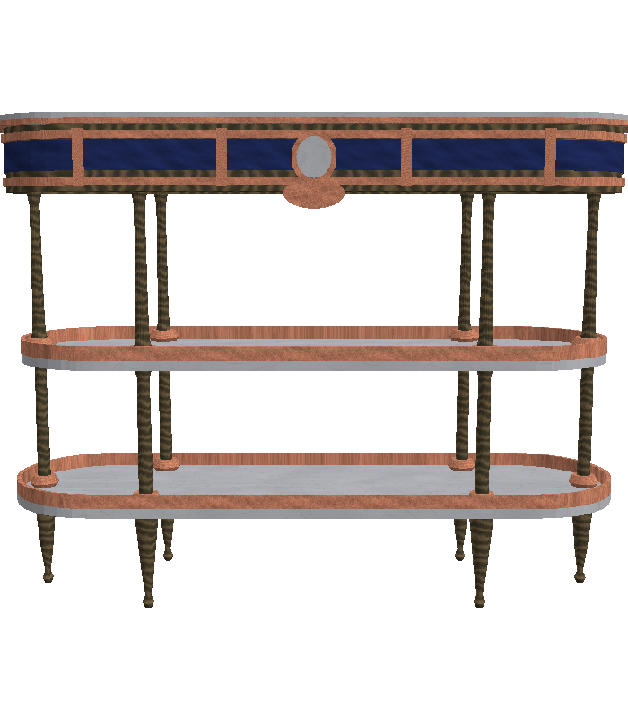
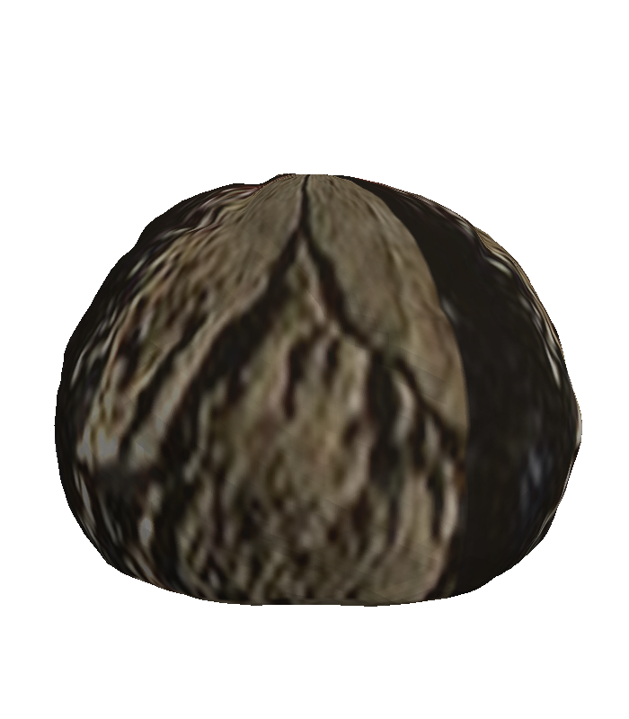
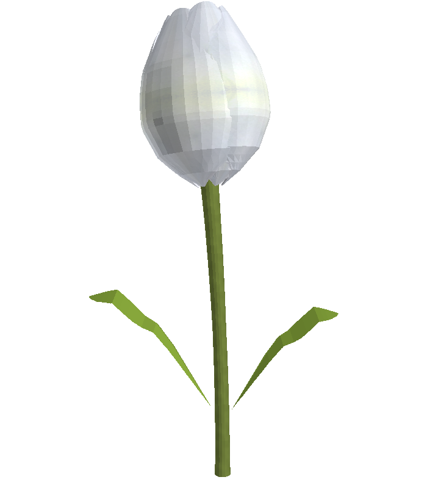

# formcast

**Turn a single photo into a small library of 3D models.**

Hand formcast one reference photo — say, a snapshot of a maple tree — and it gives
you back a handful of ready-to-use `.glb` 3D models in that same style. Not ten
copies of the *exact* tree in your photo, but ten believable variations on the
same *kind* of thing: different branches, different proportions, the same
character. Drop them into Blender, three.js, Godot, Unity, or any glTF viewer.

formcast is a single command-line tool. Behind the scenes it asks Claude Code
(running locally on your own machine) to look at your photo and *write the
procedural modeling code*, then runs that code for you to bake out the finished
models. You bring a picture; you get back models.

---

## What you can do with it

formcast has four commands:

| Command   | What it does |
| --------- | ------------ |
| `bake`    | A photo goes in; a set of seed-varied `.glb` models comes out. This is the main event. |
| `inspect` | Print (or pull back out) the metadata tucked inside each `.glb` — including the original photo and the exact script that built it. |
| `view`    | Render a preview of one model, or a whole row of variations side by side. `--save` works even with no display: it falls back to a built-in software renderer. |
| `judge`   | Show a reference photo plus two render sheets to a fresh Claude session and get a structured preference + rubric back (used to compare model quality A/B; calls the `claude` CLI). |

---

## What it makes — one photo in, a model out

Each pair below is a real benchmark item: the **reference photo** on the left, a
render of the **formcast-generated 3D model** on the right (one of several
seed-varied `.glb` outputs). These are *procedural archetypes* — believable
instances of the same kind of thing, not exact copies of the photo. The pipeline
is still improving, so each model is labelled with the **version that generated
it**, for honesty; the full visual journal with what-worked / what-didn't is in
[`SAMPLES.md`](SAMPLES.md).

| Object | Reference photo | formcast model | Made by |
|---|---|---|---|
| Maple tree |  |  | v1.2 |
| Console table |  |  | v1.2.2 |
| Moeraki boulder |  |  | v1.2.2 |
| White tulip |  |  | v1.2.2 |
| Windsor chair |  |  | v1.1 |
| Ceramic teapot |  |  | v1.2.2 |
| Azalea shrub |  |  | v1.2.2 |
| Tiffany lamp |  |  | v1.2.2 |
| Pencil |  |  | v1.2.2 |

*(Reference photos are CC0/PD or repo samples; full provenance in
[`benchmarks/manifest.json`](benchmarks/manifest.json). The pipeline is mid-stream
— the four `v1.2` items above are being re-baked under `v1.2.2`, and this table
tracks whichever version is the current champion.)*

---

## Getting started

### 1. Install the Python dependencies

```bash
pip install -r requirements.txt
```

### 2. Install Claude Code and sign in once

formcast uses the local `claude` command to do the creative heavy lifting, so it
needs to be installed and signed in once:

```bash
npm install -g @anthropic-ai/claude-code   # needs Node.js
claude                                       # run once to authenticate
```

A Claude subscription login works fine, or set `ANTHROPIC_API_KEY` if you prefer.
formcast itself never asks you for an API key.

### 3. Create the outputs folder

This repo already ships with a sample photo at `inputs/maple-tree.png`. Baked
models go in `outputs/`, which isn't tracked in git — so create it before your
first bake:

```bash
mkdir -p outputs
```

(If you forget, formcast will create the output directory for you on the first
bake — but making it yourself keeps things tidy.)

### 4. Bake your first models

Bake the bundled sample (or drop your own photo in `inputs/` and point at that):

```bash
python formcast.py bake inputs/maple-tree.png --out-dir outputs/ --count 10
```

formcast looks at the photo, works out what it's seeing, writes a procedural
generator for it, and bakes ten variations into `outputs/`. When it's done,
preview them all at once:

```bash
python formcast.py view outputs/maple-tree-*.glb
```

That's the whole loop: **photo in → a row of models out.**

---

## A few more examples

```bash
# Also bake a high/medium/low level-of-detail (LOD) chain for each variant
python formcast.py bake inputs/maple-tree.png --out-dir outputs/ --count 10 --lods

# Pin an exact model instead of the default
python formcast.py bake inputs/maple-tree.png --model claude-opus-4-8

# Look inside a finished model
python formcast.py inspect outputs/maple-tree-03.glb

# Pull the embedded photo, generator script, and description back out to files
python formcast.py inspect outputs/maple-tree-03.glb --extract ./extracted/

# Render a single model straight to a PNG (works without a display: if OpenGL
# isn't available, formcast falls back to its built-in software renderer;
# force a backend with --renderer gl|soft)
python formcast.py view outputs/maple-tree-03.glb --save preview.png

# Compare two candidate renders against the reference photo with a fresh
# Claude session as the judge (3 trials, A/B order alternated):
python formcast.py judge inputs/maple-tree.png old-contact.png new-contact.png
```

formcast handles single objects with clear structure and surfaces — natural
things (trees, shrubs, flowers, boulders, logs) and man-made ones (chairs,
tables, vases, lamps). Each class gets tailored modeling guidance under the
hood (foliage envelopes with leaf-card clumps; lathe-and-instance construction
for furniture; noise-displaced hulls for rocks). Photos of people are politely
refused. Two knobs worth knowing:

```bash
# Let the model SEE and revise its own work N times before baking (pass 3.5;
# one extra Claude call and a couple of minutes per round; 0 disables):
python formcast.py bake inputs/maple-tree.png --refine 2
```

Models bake **+Y-up** (the glTF convention), base on the ground plane, in
meters, within per-density triangle budgets. (Bakes made before v1.2 were Z-up;
`view` reads each file's embedded provenance and renders either correctly.)

---

## A quick note on trust

`bake` does two things worth understanding before you run it:

1. It runs the local `claude` CLI, restricted to its **Read** tool only — during a
   bake it can look at your image and nothing else (it can't write files or run
   commands).
2. It then **executes the Python that Claude wrote**, in a subprocess, to actually
   build the meshes. That's the whole idea of the tool — but it does mean running
   model-generated code, so run formcast on a machine you trust.

`inspect` and `view` never execute embedded code; they only read data.

---

## Logs

formcast logs what it's doing as it runs, in a standard timestamped, level-tagged
format. Stdout shows **INFO and above** by default — including running hints of what
the model is producing (its read on your photo, the surfaces it's building, and a
preview of each reply), so you can watch what's being thought about. The **same
format at full DEBUG** — per-pass and per-variant timings, plus each Claude call's
duration and token/cost usage — is always written to **`formcast.log`** (gitignored).
Add `-v`/`--verbose` to show DEBUG on screen too:

```bash
python formcast.py bake inputs/maple-tree.png --verbose
```

If a run is slow or something looks off, `formcast.log` is the first place to look
(and the handy thing to share).

---

## How it works

Curious what happens between "photo in" and "models out"? Under the hood, `bake`
runs four passes. The first three ask Claude Code (locally, in headless mode) to
author increasingly complete code; the last one is just plain plumbing.

1. **Classify & describe.** Claude looks at your photo and writes a short
   identifier (used for filenames) plus one rich paragraph describing the object's
   form, structure, surface materials, and overall character. The description is
   qualitative on purpose — it plays to the model's strengths and to the goal of
   capturing a *style*, not reconstructing one exact object.

2. **Author the geometry.** Claude writes a deterministic
   `build_mesh(seed, density)` function using `numpy` and `trimesh`, with geometry
   grouped by semantic surface name (`trunk`, `branches`, `canopy`, `rock`, …).
   formcast actually runs this code and checks the mesh is real and non-empty; if
   it fails, the error is handed back to Claude for a fix (a couple of retries).

3. **Author texturing & export.** Claude folds that geometry into one complete,
   standalone script that also pulls tileable material swatches out of your photo,
   applies UVs per surface type, assigns materials, and exports a `.glb`. Again
   formcast runs it end-to-end and confirms the result opens with real geometry.

4. **Bake.** With the generator now frozen and proven, formcast runs it N times
   with seeds `0..N-1` (optionally across detail levels) to produce
   `maple-tree-00.glb`, `maple-tree-01.glb`, and so on.

Finally, formcast tucks a small metadata bundle inside every `.glb` — the
description, the original photo, the *exact* generator script, and provenance
(which tool, model, and prompt version made it). That makes each file
self-describing and re-bakeable later with no outside context; `inspect` is how
you read it back. The metadata rides along quietly in the glTF JSON and is ignored
by your renderer, so it costs nothing at load time.

A nice consequence of all this: formcast isn't photogrammetry. It never tries to
reconstruct the precise object in your photo — it captures the *archetype*, enough
about the form and surfaces to generate an endless supply of fresh, believable
instances "of that kind." That's what makes it useful when you want variety: a
whole grove of distinct maples from a single photo of one.
