# formcast samples journal

A running, visual record of the photo → 3D experiments: for each benchmark item,
the reference photograph next to renders of what each formcast version baked
from it. Newest entries at the bottom of each section. Renders are made by
formcast's own headless software renderer (four standard angles; the "front"
view is shown inline — click the contact-sheet links for all four).

All reference photos are CC0/public-domain or repo samples; full provenance in
`benchmarks/manifest.json`. The technical evidence log (commands, costs, gate
results) is `EVALS.md`; the plans are `MASTER_PLAN.md` and `PHOTOREALISM_PLAN.md`.

## The versions so far

| Version | What it does | One-line verdict |
|---|---|---|
| **v1.1** (baseline) | Original pipeline: nature-only taxonomy, no craft guidance, blind texture crops, Z-up exports, no feedback loop. | Gets the *idea* of the object; quality is a coin flip and textures often ruined by background contamination. |
| **v1.2** | Any-object taxonomy ("classify by what the whole object IS, not its material"); per-class craft packs (foliage envelopes + clumped cards, lathe/instancing furniture, noise-displaced rocks, capsule-union creatures); +Y-up/meters/budget contract; anti-contamination texture rules (sample inside the silhouette, median of patches, no roll+blur tiling); audit gates; **pass 3.5 refine loop** — formcast renders the model's own output and shows it back for critique + revision before baking. | **Suite result: 4 of 5 promoted at 3/3 each** (maple, table, boulder, tulip); chair rejected 2/3-against — correct structure, but lost v1.1's turned-wood mass. v1.2.1 fix below. |
| **v1.2.1** | v1.2 plus: turned parts get real lathe-profile curvature (bulbs/coves read off the photo) and photo-measured member thickness; sculpted-not-flat seats; "character features from the description are what make it read as its kind" (class credibility per Joel's direction); wood-grain/wear so painted wood stops reading as plastic; smooth shading on curved organic surfaces; floating-fragment audit gate. | Chair re-match + first teapot/Tiffany-lamp bakes in progress. |

---

## Met console table — furniture (the taxonomy stress case)

Reference: Met Museum, late-18th-c. console/desserte (CC0).

| Reference photo | v1.1 baseline | v1.2 |
|---|---|---|
| 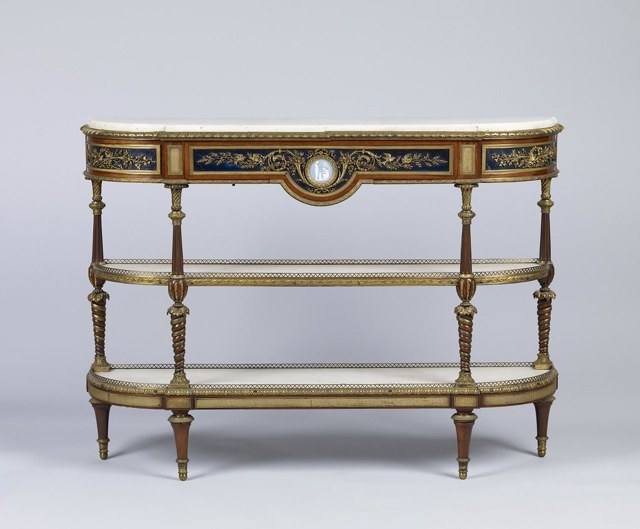 | 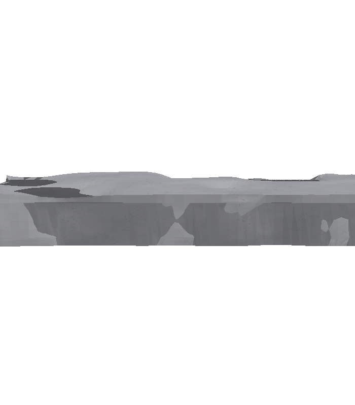 | 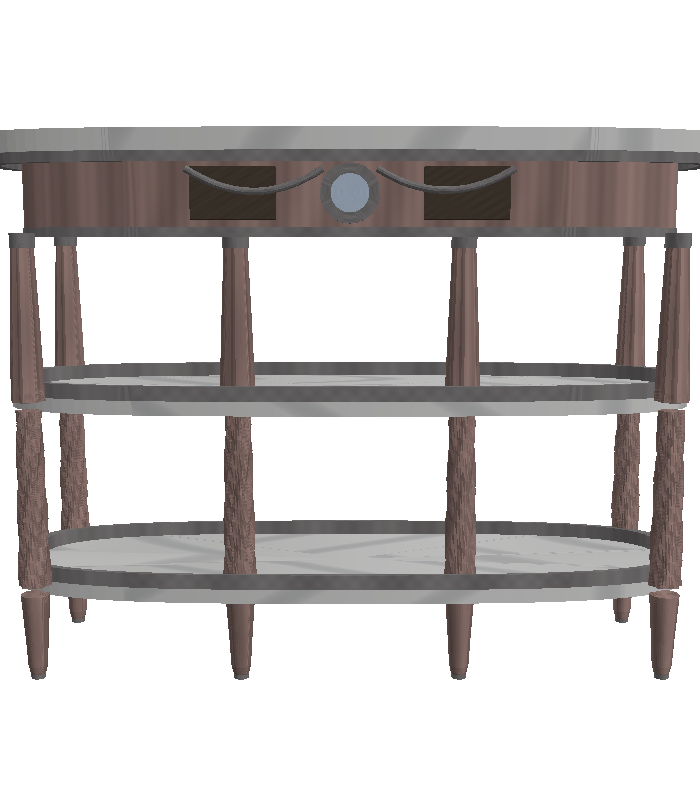 |

All angles: [v1.1 contact sheet](eval/baselines/v11-table-contact.png) · [v1.2 contact sheet](eval/v12-table-contact.png)

**v1.1:** classified the whole object as `white-statuary-marble` (it keyed on the
top's material) and produced a flat mottled **stone slab** — no legs, no table.
The nature-only class list simply had no word for furniture.

**v1.2:** classified `furniture` / `louis-xvi-marble-top-console-desserte`,
modeled semantic parts `[marble, wood, ormolu, blue_panels, cameo]`, and built an
oval veined-marble top on six turned tapered legs with **two lower shelves** —
the actual structure of the Met piece, including the little cameo medallion on
the apron. In its refine round the model looked at its own render, opened with
*"Color is completely wrong…"*, and shipped a corrected script.

**Judge (fresh Sonnet sessions, photo + both render sheets, A/B order
alternated): v1.2 preferred 3/3.** Candidate rubric ≈ silhouette 4, proportions
3–4, artifacts 3–4 vs baseline 1/1/3.

**Still wrong in v1.2 (next targets):** wood reads grey-mauve instead of warm
mahogany with gilt-bronze accents; "ormolu" surfaces aren't gold; marble veining
is smudgy; leg joins slightly chunky.

---

## Windsor chair — furniture

| Reference photo | v1.1 baseline | v1.2 |
|---|---|---|
| 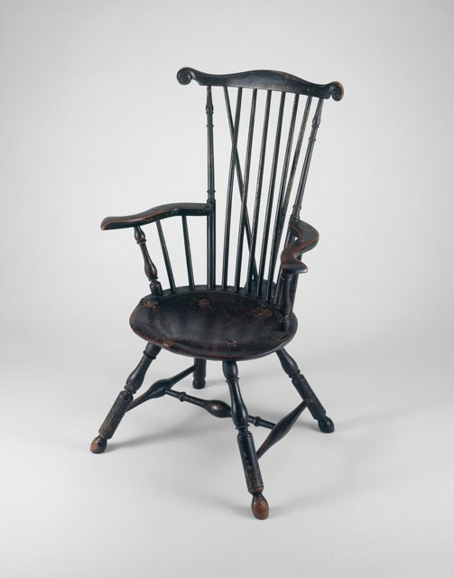 | 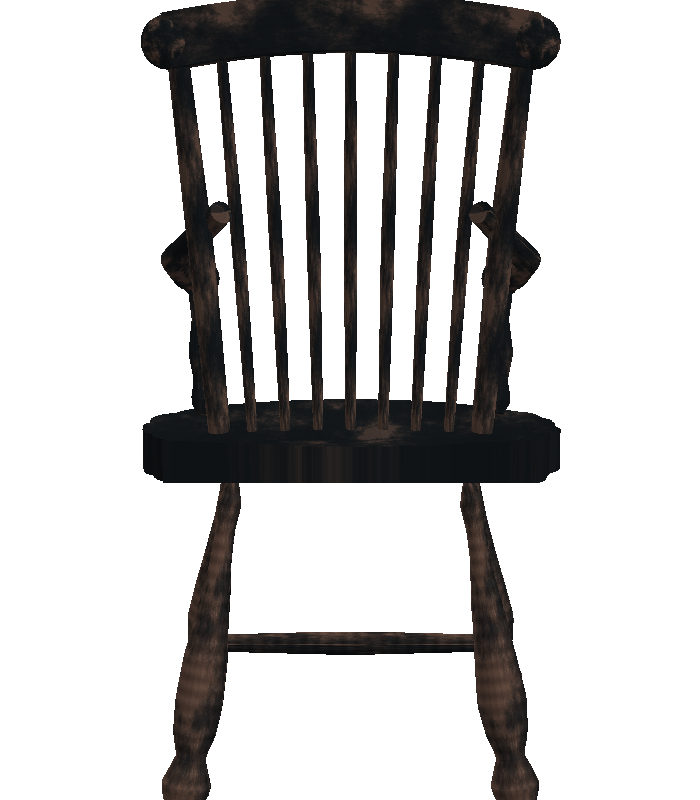 | 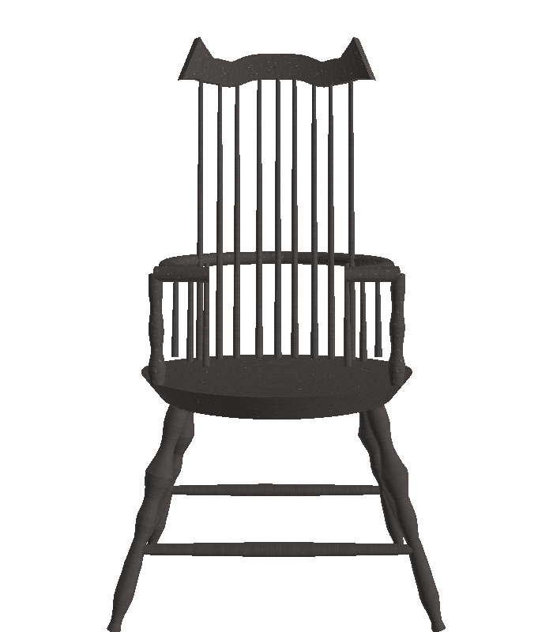 |

All angles: [v1.1 contact sheet](eval/baselines/v11-chair-contact.png) · [v1.2 contact sheet](eval/v12-chair-contact.png)

**v1.1:** the model *recognized* a `windsor-armchair` but the taxonomy forced
`class='log'` — and the texturing treated it like bark: a structurally
respectable spindle-back chair (genuinely surprising, the rich prose description
did the heavy lifting) dressed in charred near-black wood. Lesson: the
description drives geometry more than the class word; the class drives the
*materials* — both must be right.

**v1.2:** correctly `furniture` / `comb-back-windsor-armchair`, with semantic
parts `[arms, crest, legs, seat, spindles, stretchers]` and a much cleaner
comb-back silhouette (curled crest ears, bent arm rail). **But the judge
preferred v1.1 by 2/3** — and reading its reasons, fairly: v1.1's chair has
*turned-wood mass* (bulbous ball feet, chunky baluster legs, a sculpted seat)
while v1.2 reads thin and wiry with a flat-disc seat. Honest scoreboard:
correct structure ≠ convincing wood. This is also the first time the
independent judge overruled my own eyes — exactly what it's for.

**Queued fix (v1.2.1 craft pack):** turned parts need *pronounced profile
curvature* (bulbs, coves, rings matched to the photo), seats and carved parts
need sculpted displacement rather than flat extrusion, and member thicknesses
should be measured off the photo. Plus a no-floating-parts gate (one stray
sliver near the right arm).

---

## Moeraki boulder — rock, in-situ photo (hard background)

| Reference photo | v1.1 baseline | v1.2 |
|---|---|---|
| 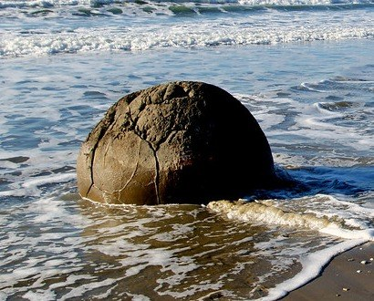 | 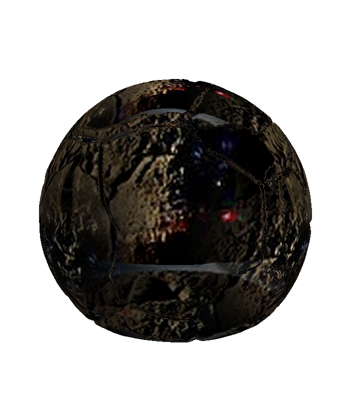 | 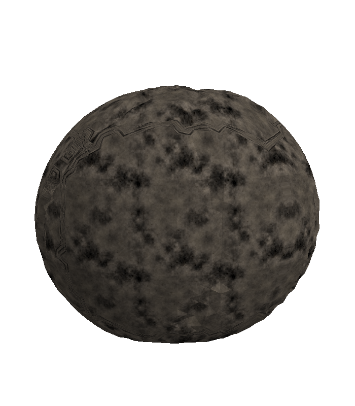 |

All angles: [v1.1 contact sheet](eval/baselines/v11-boulder-contact.png) · [v1.2 contact sheet](eval/v12-boulder-contact.png)

**v1.1:** correctly recognized a `spherical-concretion-boulder` (it knows its
Moeraki!) and the cracked-sphere geometry concept is right — but the texture
sampled blind crop rectangles that hit **ocean and surf**, so the rock wears
blue-and-red blotches on dark mud. The poster child for the anti-contamination
texture rules in v1.2.

**v1.2:** clean win — **judge 3/3** (color/material 4 vs 1). The contamination
is gone: uniform wet grey-brown mottled stone, plausible against the photo,
slightly flattened base. Honest regression worth noting: v1.2 *lost the
septarian crack ridges* that make Moeraki boulders distinctive (v1.1's geometry
had them); the surface also reads a bit concrete-like up close. Candidate fix
rides along with the texture-fidelity iteration.

---

## White tulip — flower, in-situ photo (bokeh background)

| Reference photo | v1.1 baseline | v1.2 |
|---|---|---|
|  | 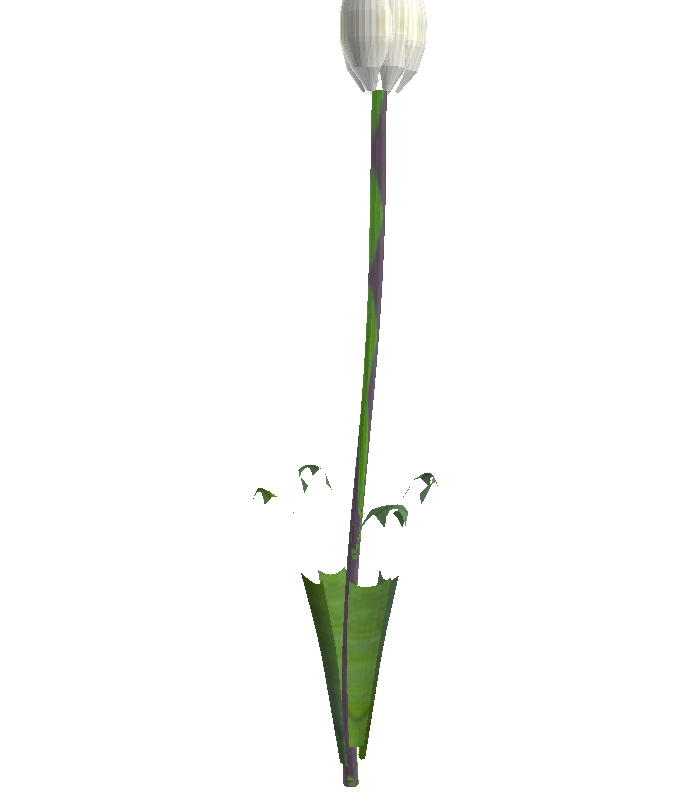 | 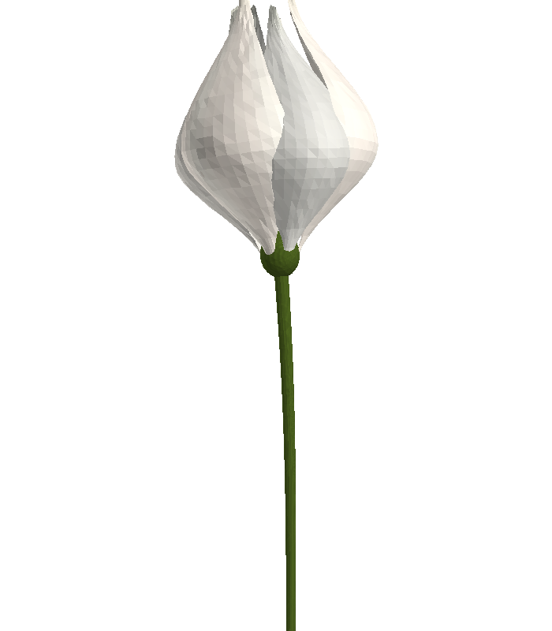 |

All angles: [v1.1 contact sheet](eval/baselines/v11-tulip-contact.png) · [v1.2 contact sheet](eval/v12-tulip-contact.png)

**v1.1:** recognizable white bloom on a stem — but the stem is striped
**purple** (crops hit the bokeh background), the petals are hard-faceted, and it
invented floating leaf scraps that connect to nothing.

**v1.2: promoted, judge 3/3** (color/material 4 vs 1–2). Purple stem gone, no
floating parts, overlapping tepals on a proper receptacle, clean green stem —
credibly a tulip bud. Still imperfect: the bud pinches into a slight
"onion-dome" (the photo's cup is softer-shouldered), petals show low-poly
facets (needs smooth shading / more segments), and the white is flat where the
photo has cream-to-grey-green gradients. These all go on the texture/shading
iteration list.

---

## Maple tree — the original flagship

| Reference photo | v1.1 baseline | v1.2 |
|---|---|---|
| 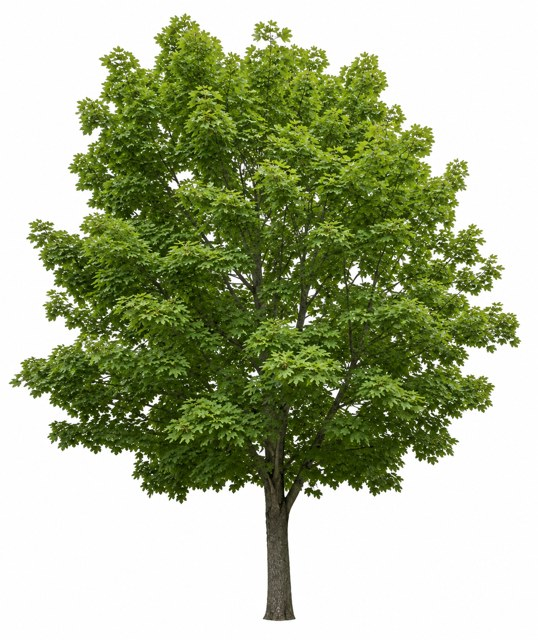 | 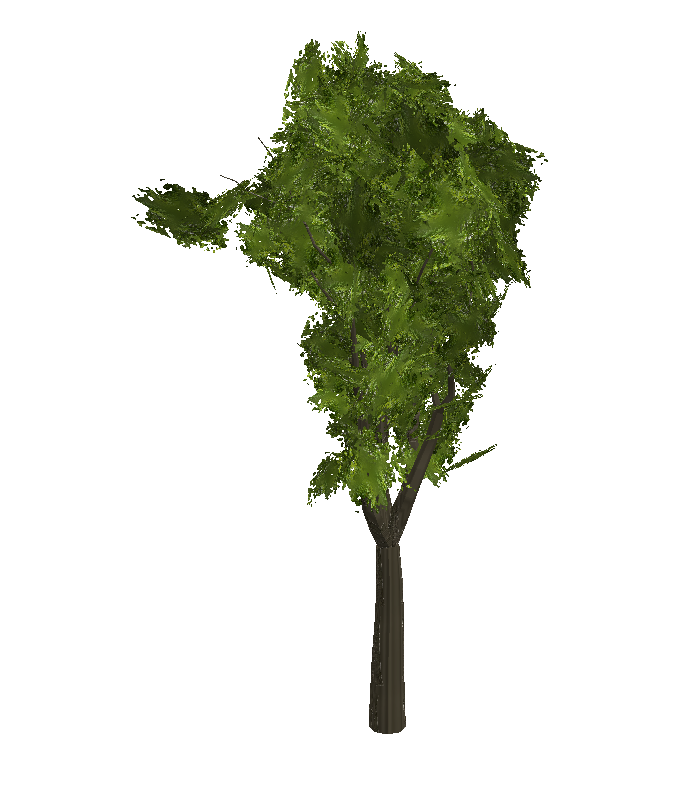 | 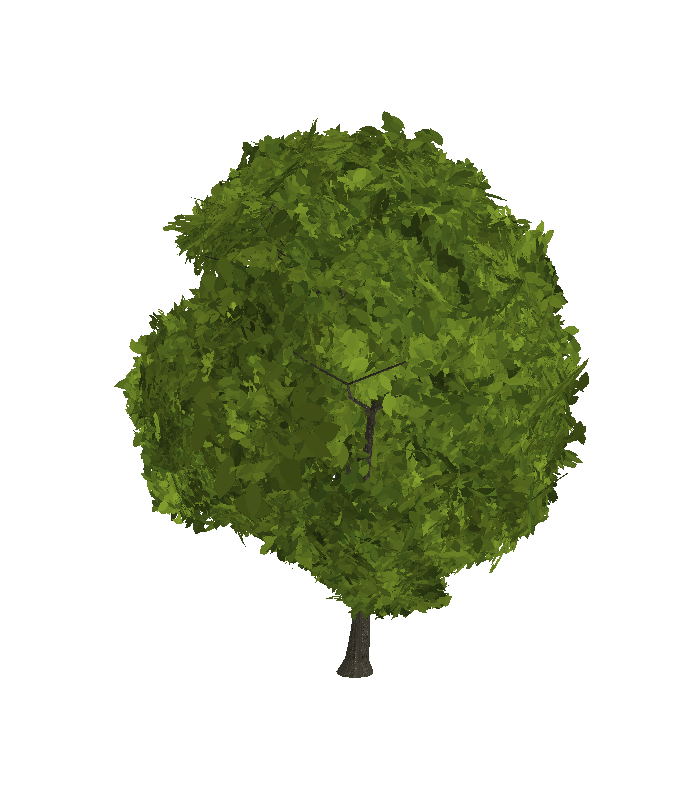 |

All angles: [v1.1 contact sheet](eval/baselines/v11-maple-contact.png) · [v1.2 contact sheet](eval/v12-maple-contact.png)

**v1.1:** decent-at-a-glance tree, but measured against the photo: crown too
narrow (w/h 0.57 vs 0.84), too sparse (47% crown fill vs 67%), one flat texture
for the whole canopy (the photo has a 4:1 sun/shade range), blurry-blob leaf
texture rather than leaf silhouettes, and a bark smear from roll+blur tiling.

**v1.2: promoted, judge 3/3** with straight 4s vs 2–3s — and both refine rounds
adopted revisions (the model kept finding improvements in its own renders).
The crown is now full, rounded and dense with visible leaf-cluster light/dark
variation; the wispy gaps and floating clumps are gone. Remaining gaps for the
next iteration: the crown is a touch *too* solid (the photo shows dark branch
glimpses through gaps), the bare trunk is shorter than the photo's ~21%, and
the foliage reads slightly flat-cartoon up close (the full 4:1 sun/shade depth
isn't there yet — the COLOR_0 machinery exists but is underused).

---

## Teapot — vessel (new benchmark item)

| Reference photo | v1.2 |
|---|---|
|  | *(queued)* |

A classic revolve-body + handle + spout vessel on a bokeh background — added to
cover the vessel class with a genuinely simple object (CC0, StockSnap).

## Tiffany peacock lamp — lamp (stretch case)

| Reference photo | v1.2 |
|---|---|
| 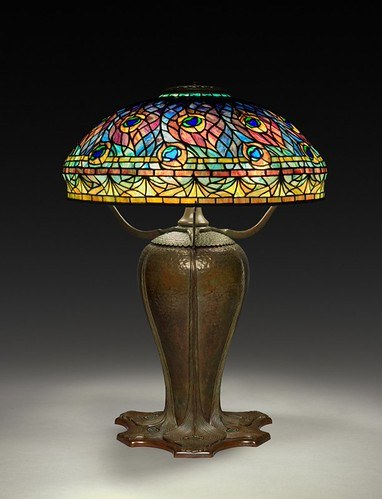 | *(queued)* |

Museum studio shot (CC0). Deliberately hard: a mosaic stained-glass shade over
a sculpted bronze base — stresses multi-material texturing well beyond wood and
leaves.

## What we've learned so far (running)

- **Closing the loop works.** The single biggest v1.2 change is that the model
  *sees renders of its own output* before the bake is frozen. First live use
  caught and fixed a global color error unprompted.
- **Classification must name the object, not its material** — otherwise the
  whole downstream concept is wrong (table→stone slab). One sentence in the
  prompt ("classify by what the WHOLE OBJECT IS") plus a broader class list
  fixed it.
- **Rich prose descriptions are remarkably load-bearing.** Even with a wrong
  class, the v1.1 chair came out chair-shaped because the description said
  "spindles, armrests, splayed legs". Craft packs + correct class add the
  *materials and methods* on top.
- **Blind texture cropping is the #1 photorealism killer on real photos.**
  Every in-situ baseline (tulip, boulder) shipped background colors into its
  materials.
- **Evaluation infrastructure pays for itself immediately.** The headless
  renderer + frozen baselines + A/B judge turned "looks better to me" into
  "3/3 preferred, silhouette 4 vs 1" — and the judge's reasoning doubles as a
  defect list for the next iteration.
- **The judge tracks human preference so far (2/2 calibration checks).** Joel's
  independent read — "chair v1.1 far better, table v1.2 far better" — matches
  the judge's verdicts on both items, including the one where the judge
  overruled my own scoring. Confidence in unattended A/B judging rises
  accordingly.
- **Improvements can silently trade away character.** The v1.2 boulder fixed
  color contamination but dropped the distinctive crack ridges v1.1 had; the
  v1.2 chair fixed structure but lost wood mass. Per-item "what got worse"
  notes are now mandatory in this journal.
