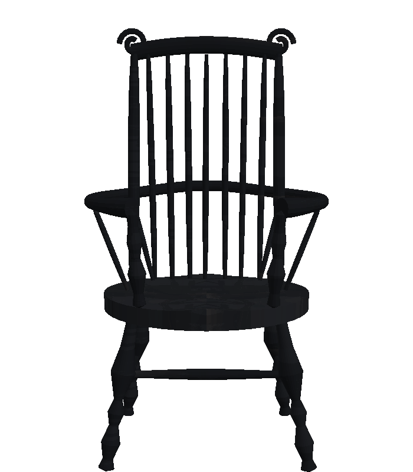
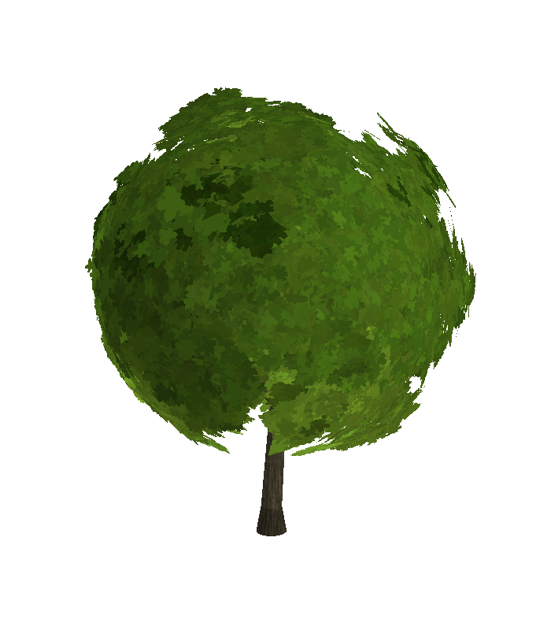
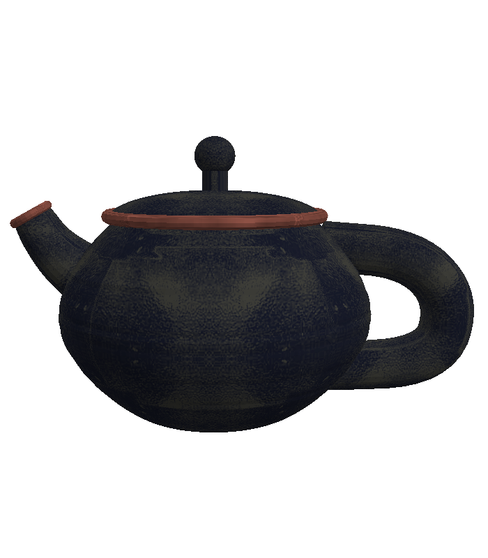
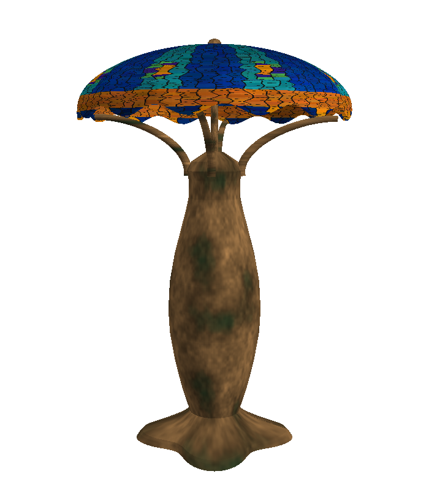
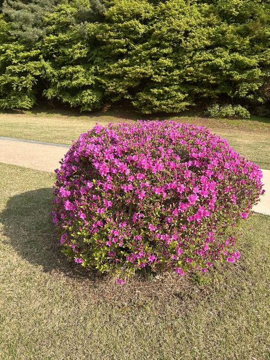
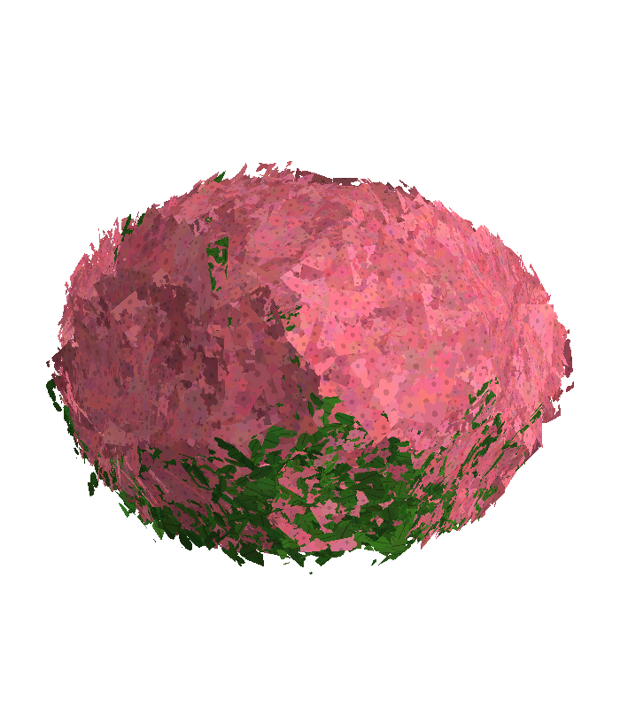
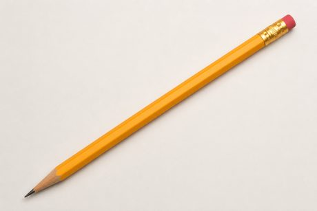
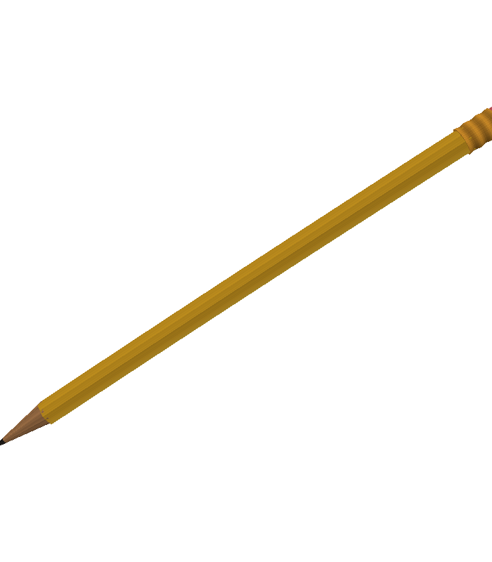

# formcast samples journal

A running, visual record of the photo → 3D experiments: for each benchmark item,
the reference photograph next to renders of what each formcast version baked
from it. Newest entries at the bottom of each section. Renders are made by
formcast's own headless software renderer (four standard angles; the "front"
view is shown inline — click the contact-sheet links for all four).

All reference photos are CC0/public-domain or repo samples; full provenance in
`benchmarks/manifest.json`. The technical evidence log (commands, costs, gate
results) is `EVALS.md`; the plans are `MASTER_PLAN.md` and `PHOTOREALISM_PLAN.md`.

## The versions so far

| Version | What it does | One-line verdict |
|---|---|---|
| **v1.1** (baseline) | Original pipeline: nature-only taxonomy, no craft guidance, blind texture crops, Z-up exports, no feedback loop. | Gets the *idea* of the object; quality is unreliable run to run and textures often ruined by background contamination. |
| **v1.2** | Any-object taxonomy ("classify by what the whole object IS, not its material"); per-class craft packs (foliage envelopes + clumped cards, lathe/instancing furniture, noise-displaced rocks, capsule-union creatures); +Y-up/meters/budget contract; anti-contamination texture rules (sample inside the silhouette, median of patches, no roll+blur tiling); audit gates; **pass 3.5 refine loop** — formcast renders the model's own output and shows it back for critique + revision before baking. | **Suite result: 4 of 5 promoted at 3/3 each** (maple, table, boulder, tulip); chair rejected 2/3-against — correct structure, but lost v1.1's turned-wood mass. v1.2.1 fix below. |
| **v1.2.1** | v1.2 plus: turned parts get real lathe-profile curvature (bulbs/coves read off the photo) and photo-measured member thickness; sculpted-not-flat seats; "character features from the description are what make it read as its kind" (class credibility per Joel's direction); wood-grain/wear so painted wood stops reading as plastic; smooth shading on curved organic surfaces; floating-fragment audit gate. | Chair re-match **lost to v1.1 (Joel's call — simplicity/essence wins)**; its lessons (simplest-geometry-that-reads; dark materials still need value variation) feed the next prompt rev. Teapot / lamp / azalea first bakes still pending. |
| **v1.2.2** | v1.2.1 plus Joel's chair lessons encoded as general principles: PASS2 **"simplicity / essence first"** (simplest geometry that reads as the kind; essential masses + clean silhouette before fine detail; no detail that muddies the silhouette); the manmade pack's turned-parts guidance **tempered** (capture the 2–4 major profile moves cleanly, no fussy micro-rings/flutes — while keeping substantial member thickness); PASS3 **very-dark-finish** rule (sample the photo's lit-edge/sheen zones and keep a visible value range, so near-black paint stops rendering as a silhouette). | **Encoded; validation pending** on the next bakes — watch furniture keep its mass while shedding fussiness, and dark surfaces keep value range. |

---

## Met console table — furniture (the taxonomy stress case)

Reference: Met Museum, late-18th-c. console/desserte (CC0).

| Reference photo | v1.1 baseline | v1.2 |
|---|---|---|
|  |  |  |

All angles: [v1.1 contact sheet](eval/baselines/v11-table-contact.png) · [v1.2 contact sheet](eval/v12-table-contact.png)

**v1.1:** classified the whole object as `white-statuary-marble` (it keyed on the
top's material) and produced a flat mottled **stone slab** — no legs, no table.
The nature-only class list simply had no word for furniture.

**v1.2:** classified `furniture` / `louis-xvi-marble-top-console-desserte`,
modeled semantic parts `[marble, wood, ormolu, blue_panels, cameo]`, and built an
oval veined-marble top on six turned tapered legs with **two lower shelves** —
the actual structure of the Met piece, including the little cameo medallion on
the apron. In its refine round the model looked at its own render, opened with
*"Color is completely wrong…"*, and shipped a corrected script.

**Judge (fresh Sonnet sessions, photo + both render sheets, A/B order
alternated): v1.2 preferred 3/3.** Candidate rubric ≈ silhouette 4, proportions
3–4, artifacts 3–4 vs baseline 1/1/3.

**Still wrong in v1.2 (next targets):** wood reads grey-mauve instead of warm
mahogany with gilt-bronze accents; "ormolu" surfaces aren't gold; marble veining
is smudgy; leg joins slightly chunky.

---

## Windsor chair — furniture

| Reference photo | v1.1 baseline | v1.2 |
|---|---|---|
|  |  |  |

All angles: [v1.1 contact sheet](eval/baselines/v11-chair-contact.png) · [v1.2 contact sheet](eval/v12-chair-contact.png)

**v1.1:** the model *recognized* a `windsor-armchair` but the taxonomy forced
`class='log'` — and the texturing treated it like bark: a structurally
respectable spindle-back chair (genuinely surprising, the rich prose description
did the heavy lifting) dressed in charred near-black wood. Lesson: the
description drives geometry more than the class word; the class drives the
*materials* — both must be right.

**v1.2:** correctly `furniture` / `comb-back-windsor-armchair`, with semantic
parts `[arms, crest, legs, seat, spindles, stretchers]` and a much cleaner
comb-back silhouette (curled crest ears, bent arm rail). **But the judge
preferred v1.1 by 2/3** — and reading its reasons, fairly: v1.1's chair has
*turned-wood mass* (bulbous ball feet, chunky baluster legs, a sculpted seat)
while v1.2 reads thin and wiry with a flat-disc seat. Honest scoreboard:
correct structure ≠ convincing wood. This is also the first time the
independent judge overruled my own eyes — exactly what it's for.

**Queued fix (v1.2.1 craft pack):** turned parts need *pronounced profile
curvature* (bulbs, coves, rings matched to the photo), seats and carved parts
need sculpted displacement rather than flat extrusion, and member thicknesses
should be measured off the photo. Plus a no-floating-parts gate (one stray
sliver near the right arm).

**v1.2.1 re-match — DECIDED: v1.1 wins (Joel's verdict, 2026-06-10):**

| v1.1 (champion) | v1.2.1 |
|---|---|
|  |  |

All angles: [v1.2.1 contact sheet](eval/v121-chair-contact.png)

The turned-wood mass arrived (real baluster bulbs and coves on the legs,
substantial members, curled comb ears) — but it renders nearly
**silhouette-black** (the script sampled the photo's near-black paint faithfully
but skipped grain/wear value variation, so internal detail vanishes). **Joel ruled
v1.1 the best and the chair is closed:** *"I still think the 1.1 chair is the
best… what I like about 1.1 is that it's simple and it captures the geometric
essence,"* whereas v1.2.1 "is trying to capture geometry details like the swirls
on the top." So **v1.1 stays champion** — and the takeaway isn't "fix v1.2.1," it's
the general principle now in the plans: **simplicity / geometric essence beats
detail-chasing.** (Two real bugs the chair still feeds back into the pipeline:
very dark materials need albedo value variation, and turned/sculpted parts must
not be over-detailed at the cost of a clean silhouette — OPUS_PLAYBOOK §3.)

**What worked:** v1.1's simple turned masses and legible silhouette. **What
didn't:** v1.2 went thin and wiry; v1.2.1 over-corrected into heavy, dark, and
over-detailed. The lesson is to aim for the *simplest* geometry that still reads
unmistakably as the kind.

---

## Moeraki boulder — rock, in-situ photo (hard background)

| Reference photo | v1.1 baseline | v1.2 |
|---|---|---|
|  |  |  |

All angles: [v1.1 contact sheet](eval/baselines/v11-boulder-contact.png) · [v1.2 contact sheet](eval/v12-boulder-contact.png)

**v1.1:** correctly recognized a `spherical-concretion-boulder` (it knows its
Moeraki!) and the cracked-sphere geometry concept is right — but the texture
sampled blind crop rectangles that hit **ocean and surf**, so the rock wears
blue-and-red blotches on dark mud. The poster child for the anti-contamination
texture rules in v1.2.

**v1.2:** clean win — **judge 3/3** (color/material 4 vs 1). The contamination
is gone: uniform wet grey-brown mottled stone, plausible against the photo,
slightly flattened base. Honest regression worth noting: v1.2 *lost the
septarian crack ridges* that make Moeraki boulders distinctive (v1.1's geometry
had them); the surface also reads a bit concrete-like up close. Candidate fix
rides along with the texture-fidelity iteration.

---

## White tulip — flower, in-situ photo (bokeh background)

| Reference photo | v1.1 baseline | v1.2 |
|---|---|---|
|  |  |  |

All angles: [v1.1 contact sheet](eval/baselines/v11-tulip-contact.png) · [v1.2 contact sheet](eval/v12-tulip-contact.png)

**v1.1:** recognizable white bloom on a stem — but the stem is striped
**purple** (crops hit the bokeh background), the petals are hard-faceted, and it
invented floating leaf scraps that connect to nothing.

**v1.2: promoted, judge 3/3** (color/material 4 vs 1–2). Purple stem gone, no
floating parts, overlapping tepals on a proper receptacle, clean green stem —
credibly a tulip bud. Still imperfect: the bud pinches into a slight
"onion-dome" (the photo's cup is softer-shouldered), petals show low-poly
facets (needs smooth shading / more segments), and the white is flat where the
photo has cream-to-grey-green gradients. These all go on the texture/shading
iteration list.

---

## Maple tree — the original flagship

| Reference photo | v1.1 baseline | v1.2 |
|---|---|---|
|  |  |  |

All angles: [v1.1 contact sheet](eval/baselines/v11-maple-contact.png) · [v1.2 contact sheet](eval/v12-maple-contact.png)

**v1.1:** decent-at-a-glance tree, but measured against the photo: crown too
narrow (w/h 0.57 vs 0.84), too sparse (47% crown fill vs 67%), one flat texture
for the whole canopy (the photo has a 4:1 sun/shade range), blurry-blob leaf
texture rather than leaf silhouettes, and a bark smear from roll+blur tiling.

**v1.2: promoted, judge 3/3** with straight 4s vs 2–3s — and both refine rounds
adopted revisions (the model kept finding improvements in its own renders).
The crown is now full, rounded and dense with visible leaf-cluster light/dark
variation; the wispy gaps and floating clumps are gone. Remaining gaps for the
next iteration: the crown is a touch *too* solid (the photo shows dark branch
glimpses through gaps), the bare trunk is shorter than the photo's ~21%, and
the foliage reads slightly flat-cartoon up close (the full 4:1 sun/shade depth
isn't there yet — the COLOR_0 machinery exists but is underused).

**v1.2.2 re-bake (champion stays v1.2):**

| v1.2 (champion) | v1.2.2 |
|---|---|
|  |  |

All angles: [v1.2.2 contact sheet](eval/v122-maple-contact.png)

Re-baked under v1.2.2 so the maple shows a current-version render. It's a near
tie: the v1.2.2 crown is full and round but a touch smoother with a couple of
stray edge wisps, while v1.2 keeps marginally more crown *depth* (lumpier
leaf-clumps, a hint of branch structure). The v1.2.2 changes (simplicity /
dark-material) don't target foliage, so no improvement is expected — and there
isn't one. **Champion stays v1.2.** This is direct evidence that the real lever
for plants is the leaf-silhouette atlas (not yet built), not prompt tweaks.

---

## Teapot — vessel (new benchmark item)

| Reference photo | v1.2.2 (first bake) |
|---|---|
|  |  |

All angles: [v1.2.2 contact sheet](eval/v122-teapot-contact.png)

A classic revolve-body + handle + spout vessel on a bokeh background — added to
cover the vessel class with a genuinely simple object (CC0, StockSnap). First
bake under **v1.2.2**, and a useful coincidence: it's a **black** glaze, so it
stresses the new dark-material rule head-on.

**v1.2.2 (first champion):** unmistakably a teapot — bulbous body, upturned
spout, open loop handle, domed lid with a ball-knob finial, and the oxblood
accent band rimming the lid (and spout lip). The refine round caught a too-squat
body (front aspect 2.24) and rounded it out. **The dark-material rule landed:**
the black glaze reads as *form* with a speckled, stony texture and visible value
range — not the flat black silhouette the v1.2.1 chair became, which is exactly
what the rule was written to prevent. What's a touch off vs the photo: the body
is slightly wider/squatter, the glaze a bit more speckled than the photo's smooth
matte, and the spout sits a little long. Tier-2 (my eyes): silhouette 4,
proportions 4, surface 4, color/material 4, artifacts 4.

## Tiffany peacock lamp — lamp (stretch case)

| Reference photo | v1.2.2 (first bake) |
|---|---|
|  |  |

All angles: [v1.2.2 contact sheet](eval/v122-lamp-contact.png)

Museum studio shot (CC0). Deliberately hard: a mosaic stained-glass shade over a
sculpted bronze base — stresses multi-material texturing well beyond wood and
leaves. It took three attempts (honest findings all): (1) first attempt **timed
out in pass 2** authoring the mosaic as geometry; (2) a retry at `--cli-timeout
2700` **cleared pass 2** — building the shade as a *faceted dome surface*, not
tile solids (the simplicity principle helping) — but **pass 3 hit the session
cap**; (3) after the cap reset, it completed.

**v1.2.2 (first champion):** for the hardest item, a genuinely credible Tiffany
lamp — the two-mass mushroom silhouette is right (domed leaded-glass shade over a
swelling bronze vasiform base, curved arms bridging), the shade reads as
jewel-toned leaded glass (blue-green field, amber scalloped skirt, suggested
peacock "eyes"), and the base reads as patinated bronze. The refine round made it
tall and slender (aspect 0.66) to match the reference. **What worked:** the
mosaic-as-texture approach (faceted dome + texture) sidestepped the tile-geometry
trap *and* looks right; correct multi-material palette. **What didn't:** the
peacock "eyes" are abstract orange blobs rather than distinct feather motifs, the
leaded came-lines aren't crisp, and the bronze base reads a little soft/lumpy.
Past the "a mediocre lamp is fine" bar. Tier-2 (my eyes): silhouette 4,
proportions 4, surface 3, color/material 4, artifacts 3.

## Azalea — shrub (new benchmark item)

| Reference photo | v1.2.2 (first bake) |
|---|---|
|  |  |

All angles: [v1.2.2 contact sheet](eval/v122-azalea-contact.png)

A single, isolated, cleanly **rounded mounded azalea** in full magenta bloom on a
lawn, with a green hedge/treeline backdrop — added 2026-06-10 to give the foliage
pack a non-tree shrub with a strong whole-plant silhouette. CC0 (WordPress Photo
Directory). *(Swapped in for an earlier AI-generated bush whose license was
unknown.)*

**v1.2.2 (first champion):** reads unmistakably as a flowering mounded shrub — a
clean rounded dome in azalea magenta with green foliage, sitting solidly on the
ground. The refine round earned its keep: it caught the first attempt reading as
"a little *tree*" (exposed woody trunk, hollow underside) and rebuilt it as a
solid mound — a nice demonstration of simplicity/essence (the dome silhouette is
what sells it). **What worked:** clean mounded silhouette, correct magenta-bloom +
green palette, legible at a glance. **What didn't:** the flowers read as a pink
"cap" with green only at the base, rather than blooms distributed over the whole
mound with foliage interspersed (as in the photo); and the bloom is a blotchy
painted blanket, not distinct azalea flowers — the foliage pack still needs the
leaf/flower-silhouette atlas (OPUS_PLAYBOOK step 5c) and more sun/shade depth.
Tier-2 (my eyes): silhouette 4, proportions 4, surface 3, color/material 4,
artifacts 4.

## Pencil — tool (Joel-supplied permanent example)

| Reference photo | v1.2.2 (first bake) |
|---|---|
|  |  |

All angles: [v1.2.2 contact sheet](eval/v122-pencil-contact.png)

A classic yellow #2 hexagonal pencil on a clean light background (Joel-supplied,
tracked at `inputs/pencil.png`). Deliberately **simple** — home turf for the
simplicity/essence principle — and a compact multi-material test: painted hex
shaft, sharpened wood cone with a graphite point, crimped brass ferrule, pink
eraser.

**v1.2.2 (first champion):** a textbook pencil — clean elongated hexagonal shaft,
sharpened wood cone to a dark graphite point, banded ferrule, pink eraser. The
refine round even matched the photo's **diagonal pose** (front aspect 1.50 ≈ the
photo's 1.46). The simplicity/essence principle's clearest win yet — a simple
object rendered cleanly and unmistakably. **What worked:** silhouette,
proportions, the bright yellow paint, distinct graphite/eraser/ferrule zones.
**What didn't:** the brass ferrule reads a touch orange rather than metallic, and
the bare-wood collar near the tip is faint. Tier-2 (my eyes): silhouette 5,
proportions 5, surface 4, color/material 4, artifacts 5.

## What happens next

Continuation is handed to Opus: **`OPUS_PLAYBOOK.md`** is the step-by-step
script (exact commands, decision rules, pacing). State: the chair lessons are
encoded as **v1.2.2** prompt principles; teapot + azalea baked as v1.2.2 first
champions (the dark-material rule validated on the black teapot); the
tiffany-lamp (stretch case) cleared on the 3rd attempt (mosaic as faceted surface
+ texture) — all 8 items now have champions; the pencil (Joel-supplied) bakes
next. **Direction (Joel): optimize the GENERAL case, don't over-index on any one
example** — the v1.1 chair is a lucky old-pipeline outlier we accept rather than
chase. Highest-leverage next lever: the **leaf/flower silhouette atlas + sun-shade
depth** (helps every plant; the #1 recurring weakness across maple + azalea).
Then: a one-command `formcast eval` regression net, broaden class coverage (a
creature/dog), and a single v1.2.2 checkpoint re-bake of the chair to de-outlier
the benchmark.

## What we've learned so far (running)

- **Closing the loop works.** The single biggest v1.2 change is that the model
  *sees renders of its own output* before the bake is frozen. First live use
  caught and fixed a global color error unprompted.
- **Classification must name the object, not its material** — otherwise the
  whole downstream concept is wrong (table→stone slab). One sentence in the
  prompt ("classify by what the WHOLE OBJECT IS") plus a broader class list
  fixed it.
- **Rich prose descriptions are remarkably load-bearing.** Even with a wrong
  class, the v1.1 chair came out chair-shaped because the description said
  "spindles, armrests, splayed legs". Craft packs + correct class add the
  *materials and methods* on top.
- **Blind texture cropping is the #1 photorealism killer on real photos.**
  Every in-situ baseline (tulip, boulder) shipped background colors into its
  materials.
- **Evaluation infrastructure pays for itself immediately.** The headless
  renderer + frozen baselines + A/B judge turned "looks better to me" into
  "3/3 preferred, silhouette 4 vs 1" — and the judge's reasoning doubles as a
  defect list for the next iteration.
- **The judge tracks human preference so far (2/2 calibration checks).** Joel's
  independent read — "chair v1.1 far better, table v1.2 far better" — matches
  the judge's verdicts on both items, including the one where the judge
  overruled my own scoring. Confidence in unattended A/B judging rises
  accordingly.
- **Improvements can silently trade away character.** The v1.2 boulder fixed
  color contamination but dropped the distinctive crack ridges v1.1 had; the
  v1.2 chair fixed structure but lost wood mass. Per-item "what got worse"
  notes are now mandatory in this journal.
- **A per-example win can be a lucky outlier — optimize the general case.** The
  v1.1 chair beat every newer version, but it won by accident (a rich
  description drove chair-shaped geometry despite a wrong class, and bark-style
  sampling gave value-rich dark wood). We accept it as an outlier rather than
  special-case the pipeline to reproduce that luck. The job is a program that
  works well across *all* objects; lessons from one example only matter insofar
  as they generalize.
- **Dark materials need a value range, not an average tone (v1.2.2).** Encoding
  "very dark finishes must sample sheen/highlight zones and keep a visible value
  range" fixed the v1.2.1 chair's black-silhouette failure — validated first try
  on the black teapot, which renders as form, not a blob.
- **The refine loop fixes the right things when the gap is structural.** It
  caught the teapot's too-squat body and rebuilt the azalea from "a little tree"
  into a clean mound — both pushes toward the simplest legible silhouette.
- **Heavy repeating surface detail belongs in TEXTURE, not geometry.** The
  Tiffany lamp's mosaic shade timed out pass 2 as tile geometry; with a longer
  timeout the model built it as a faceted dome (the simplicity line helping).
  Lesson queued for the prompt: mosaic/leaded glass = faceted surface + mosaic
  texture, never per-tile solids.
